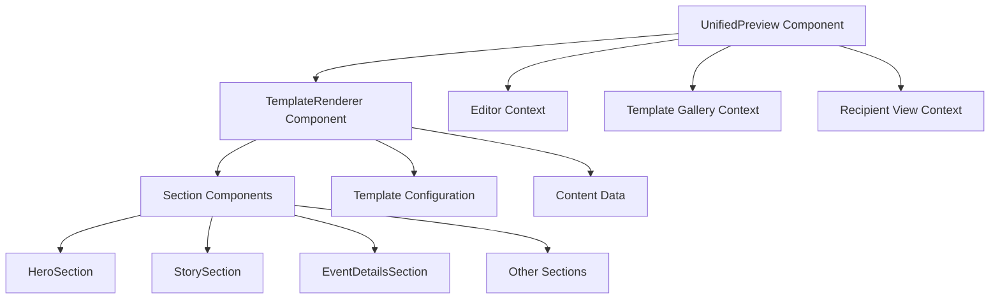
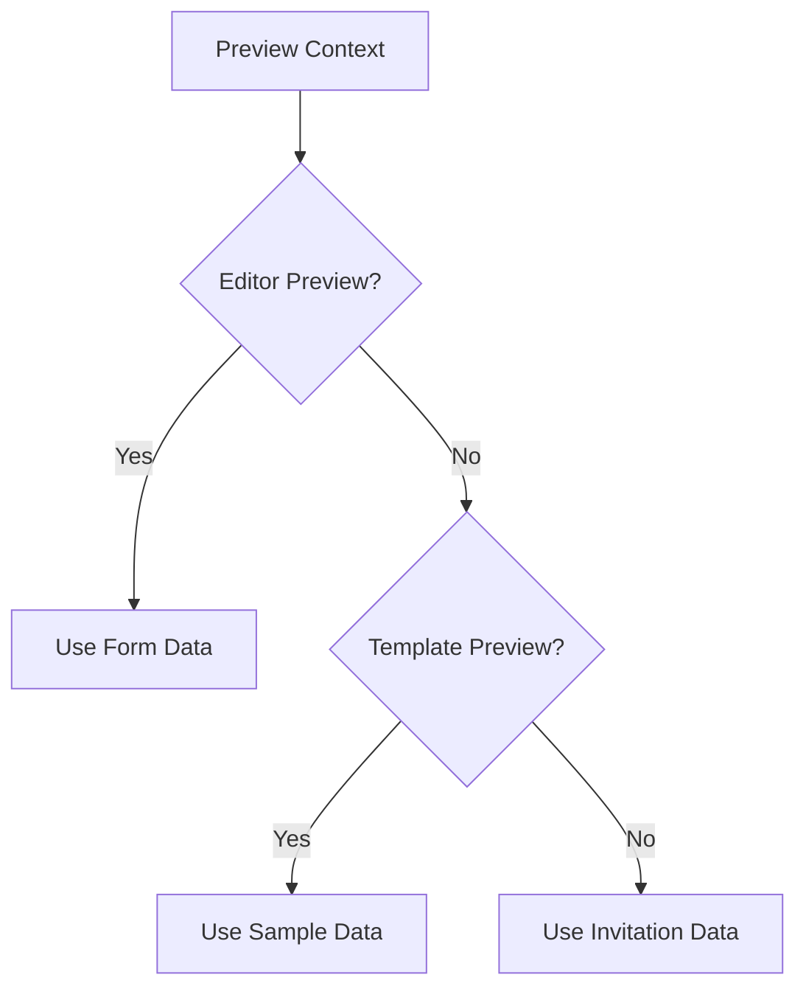

# Component Consistency Design Document

## Overview

This document outlines the design approach to ensure that preview components and section components in the invitation system have a single source of truth for consistency across all preview contexts. The design also addresses responsive behavior, including mobile live previews on desktop.

## Architecture

### Current Implementation

The current system has several preview contexts:
1. **Editor Preview** - Live preview in the editor interface
2. **Template Preview** - Preview of templates in the gallery
3. **Full-screen Preview** - Recipient view of the invitation
4. **Published Invitation** - Final invitation view

Each context currently uses different rendering approaches, leading to potential inconsistencies.

### Proposed Unified Architecture



### Key Design Principles

1. **Single Source of Truth**: All preview contexts will use the same `TemplateRenderer` component with the same data flow
2. **Consistent Data Flow**: All contexts will receive the same template configuration and content data structures
3. **Responsive Design**: All components will be responsive by default with mobile-first approach
4. **Mobile Preview Simulation**: Desktop previews will simulate mobile viewport for accurate representation

## Component Structure

### UnifiedPreview Component

The `UnifiedPreview` component will serve as the single entry point for all preview contexts:

| Property | Type | Description |
|---------|------|-------------|
| invitation | Invitation | Invitation data for editor and full-screen previews |
| formData | Partial<InvitationContent> | Form data for editor preview |
| template | Template | Template data for template gallery preview |
| className | string | Additional CSS classes |
| isEditorPreview | boolean | Flag for editor context |
| isTemplatePreview | boolean | Flag for template gallery context |

### TemplateRenderer Component

The `TemplateRenderer` component will handle the actual rendering of templates:

| Property | Type | Description |
|---------|------|-------------|
| template | Template | Template definition |
| content | InvitationContent | Content data |
| customizations | DeepPartial<TemplateConfig> | Custom theme overrides |
| isPreview | boolean | Preview mode flag |
| className | string | Additional CSS classes |

### Section Components

All section components (HeroSection, StorySection, etc.) will follow a consistent interface:

| Property | Type | Description |
|---------|------|-------------|
| content | SectionContent | Section-specific content |
| config | TemplateConfig | Template configuration |
| sectionConfig | SectionConfig | Section configuration |
| isPreview | boolean | Preview mode flag |

## Responsive Design Strategy

### Mobile-First Approach

All components will be designed with a mobile-first approach, ensuring they work well on small screens before scaling up to larger displays.

### Responsive Breakpoints

| Breakpoint | Screen Size | Usage |
|------------|-------------|-------|
| xs | < 480px | Small mobile devices |
| sm | 480px - 768px | Mobile devices |
| md | 768px - 1024px | Tablets |
| lg | 1024px - 1280px | Desktops |
| xl | > 1280px | Large desktops |

### Mobile Preview Simulation

For desktop previews that need to simulate mobile views:

1. **Container-based Simulation**: Wrap previews in containers that match mobile dimensions
2. **Viewport Meta Tag**: For full-screen previews, use appropriate viewport settings
3. **CSS Media Queries**: Use responsive CSS to adapt layouts based on container size

## Data Flow Consistency

### Template Configuration

All preview contexts will use the same template configuration structure:

```typescript
interface TemplateConfig {
  layout: {
    maxWidth: string;
    padding: string;
    spacing: string;
    borderRadius: string;
  };
  colors: {
    primary: string;
    secondary: string;
    accent: string;
    background: string;
    text: string;
    textSecondary: string;
    border: string;
  };
  typography: {
    fontFamily: string;
    headingFont: string;
    bodyFont: string;
    fontSize: {
      xs: string;
      sm: string;
      base: string;
      lg: string;
      xl: string;
      '2xl': string;
      '3xl': string;
      '4xl': string;
    };
  };
  sections: SectionConfig[];
  animations: {
    enabled: boolean;
    duration: number;
    easing: string;
    staggerDelay: number;
  };
}
```

### Content Data Structure

All preview contexts will use the same content data structure:

```typescript
interface InvitationContent {
  heroSection: HeroContent;
  storySection?: StoryContent;
  eventDetails: EventDetails;
  gallerySection?: GalleryContent;
  giftSection?: GiftContent;
  closingSection?: ClosingContent;
  // ... other sections
}
```

## Implementation Plan

### Phase 1: Unified Preview Component

1. Enhance `UnifiedPreview` to handle all preview contexts
2. Ensure consistent data mapping for each context
3. Implement proper error handling and fallbacks

### Phase 2: TemplateRenderer Consistency

1. Standardize section rendering logic
2. Ensure consistent ordering and visibility handling
3. Implement proper theme merging

### Phase 3: Responsive Design

1. Update all section components with responsive styling
2. Implement mobile preview simulation in editor
3. Add responsive utilities for consistent behavior

### Phase 4: Testing and Validation

1. Test all preview contexts for consistency
2. Validate responsive behavior across devices
3. Ensure performance is maintained

## Business Logic Layer

### Preview Context Management

The system will determine the appropriate content and configuration based on context:



### Theme Consistency

All previews will use the same theme application logic:

1. Base template configuration
2. Custom theme overrides (if any)
3. Dynamic CSS variable application
4. Consistent color and typography handling

## Middleware & Interceptors

### Responsive Preview Middleware

A middleware component will handle responsive preview simulation:

1. Detect preview context
2. Apply appropriate viewport constraints
3. Inject responsive CSS classes
4. Handle mobile simulation on desktop

### Theme Application Interceptor

An interceptor will ensure consistent theme application:

1. Validate template configuration
2. Merge customizations with base config
3. Apply CSS variables to DOM
4. Handle theme change notifications

## Testing Strategy

### Unit Tests

1. **UnifiedPreview Component Tests**
   - Context-specific rendering
   - Data mapping accuracy
   - Error handling

2. **TemplateRenderer Component Tests**
   - Section rendering consistency
   - Theme application
   - Responsive behavior

3. **Section Component Tests**
   - Individual section rendering
   - Responsive styling
   - Theme integration

### Integration Tests

1. **Preview Context Consistency**
   - Verify identical rendering across contexts
   - Validate data flow consistency
   - Test theme application uniformity

2. **Responsive Behavior Tests**
   - Mobile preview simulation accuracy
   - Breakpoint handling
   - Touch interaction support

### Visual Regression Tests

1. **Cross-context Visual Consistency**
   - Compare editor preview with full-screen preview
   - Validate template gallery preview consistency
   - Ensure mobile simulation accuracy

2. **Responsive Layout Tests**
   - Test various screen sizes
   - Validate component responsiveness
   - Check mobile-specific styling