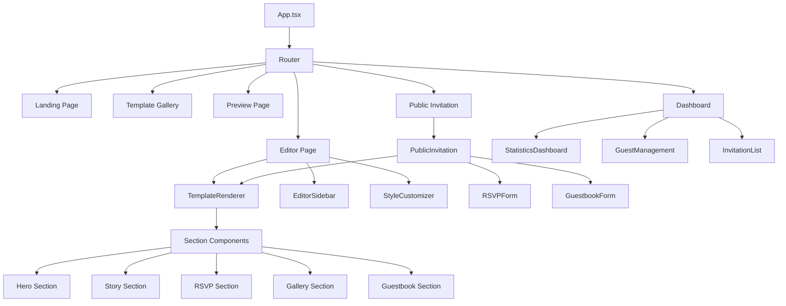

# Menantikan Digital Invitation Platform - System Design

## Overview

**Project Name:** Menantikan  
**Domain:** [https://menantikan.com](https://menantikan.com)  
**Tagline:** Create, customize, and share meaningful digital invitations

Menantikan is an interactive digital invitation platform that enables users to create, customize, and share personalized invitations with dynamic templates, high-level personalization, and Firebase-based interactive systems. The platform serves as a comprehensive solution for event organizers to design beautiful digital invitations and manage guest interactions in real-time.

**Core Value Proposition:**
- Eliminates the need for physical invitation printing and distribution
- Provides real-time guest interaction capabilities (RSVP, guestbook)
- Offers highly customizable templates with professional designs
- Enables seamless event management through integrated dashboard

## Technology Stack & Dependencies

### Frontend Architecture
- **Build Tool:** Vite (Fast development and optimized production builds)
- **Framework:** React 19.1.1 with TypeScript for type safety
- **Styling:** TailwindCSS 4.1.14 for utility-first CSS approach
- **State Management:** Zustand (planned) for lightweight state management
- **Animations:** Framer Motion (planned) for smooth transitions and interactions
- **UI Components:** Radix UI primitives with custom design system

### Backend & Services
- **Authentication:** Firebase Auth with Google Sign-In integration
- **Database:** Firestore for real-time data storage and synchronization
- **File Storage:** Firebase Storage for media assets (images, music)
- **Cloud Functions:** Firebase Functions for server-side logic and webhooks
- **Hosting:** Hostinger with CI/CD pipeline deployment

### Supporting Libraries
- **Component Styling:** class-variance-authority for component variant management
- **Utility Functions:** clsx and tailwind-merge for conditional styling
- **Icons:** Lucide React for consistent iconography

## Component Architecture

### Component Hierarchy



### Core Component Definitions

**TemplateRenderer Component**
- Responsible for rendering invitation templates based on JSON configuration
- Accepts template data and user customizations as props
- Supports dynamic theming through CSS custom properties
- Handles responsive layout across different screen sizes

**EditorSidebar Component**
- Provides template customization interface
- Contains form controls for colors, fonts, content editing
- Real-time preview updates through state management
- Auto-save functionality to Firebase

**Section Components**
- Modular invitation sections (Hero, Story, RSVP, Gallery, Guestbook)
- Each section is independently configurable
- Supports show/hide functionality
- Drag-and-drop reordering capability (Phase 4)

### Props/State Management Strategy

**Template Data Structure**
- JSON-based template configuration system
- Separation of content data and styling configuration
- Theme inheritance system (base template + user customizations)

**State Management Layers**
- Local component state for UI interactions
- Zustand store for editor state and form data
- Firebase real-time listeners for collaborative features
- Auto-save mechanism with optimistic updates

### Component Lifecycle & Hooks

**Editor Page Lifecycle**
- Load template data on component mount
- Initialize auto-save timer for user modifications
- Set up Firebase listeners for real-time collaboration
- Clean up listeners and save pending changes on unmount

**Public Invitation Lifecycle**
- Fetch invitation data based on URL slug
- Load custom theme and media assets
- Initialize analytics tracking
- Set up real-time listeners for guestbook updates

## Routing & Navigation

### Route Structure

| Route | Component | Purpose | Auth Required |
|-------|-----------|---------|---------------|
| `/` | Landing Page | Marketing and template showcase | No |
| `/templates` | Template Gallery | Template selection interface | No |
| `/editor/:id` | Editor Page | Invitation customization interface | Yes |
| `/preview/:id` | Preview Page | Live preview before publishing | Yes |
| `/publish/:id` | Publish Page | Publication settings and link generation | Yes |
| `/invitation/:slug` | Public Invitation | Public-facing invitation page | No |
| `/dashboard` | Dashboard | User's invitation management | Yes |
| `/invitation/:slug?to=:guest` | Personalized Invitation | Guest-specific invitation link | No |

### Navigation Patterns

**Protected Routes**
- Authentication middleware wraps editor and dashboard routes
- Redirect to login page for unauthenticated users
- Persistent authentication state across browser sessions

**Deep Linking Support**
- Template editor supports shareable URLs with auto-save state
- Public invitations support social media preview metadata
- Guest-specific URLs maintain personalization context

## Styling Strategy

### Design System Architecture

**Color System**
- Primary brand colors with HSL-based variants
- Template-specific color palettes stored in JSON
- Dynamic CSS custom property injection for real-time theming
- Dark mode support through TailwindCSS utilities

**Typography Scale**
- Responsive font sizing using TailwindCSS utilities
- Template-specific font family selections
- Proper heading hierarchy and accessibility compliance
- Support for custom font uploads (premium feature)

**Component Styling Approach**
- Utility-first styling with TailwindCSS
- Component variants managed through class-variance-authority
- Shared design tokens through CSS custom properties
- Template-specific overrides through scoped CSS classes

### Responsive Design Strategy

**Breakpoint Strategy**
- Mobile-first responsive design approach
- Template layouts adapt to screen size constraints
- Touch-friendly interfaces for mobile editing
- Desktop-optimized editor interface with enhanced controls

## State Management

### Zustand Store Architecture

**Editor Store**
- Current template data and user modifications
- Undo/redo functionality for editor actions
- Auto-save state and pending changes tracking
- Form validation state and error handling

**User Store**
- Authentication state and user profile data
- User preferences and settings
- Subscription status and feature access levels

**Invitation Store**
- Active invitation data and metadata
- Guest list and RSVP responses
- Guestbook messages and moderation queue
- Analytics data and engagement metrics

### Data Synchronization Strategy

**Real-time Updates**
- Firebase Firestore listeners for live collaboration
- Optimistic updates for improved user experience
- Conflict resolution for concurrent edits
- Offline support with local data persistence

## API Integration Layer

### Firebase Integration Architecture

**Authentication Flow**
- Google OAuth integration for seamless sign-in
- Anonymous user support for preview functionality
- User profile creation and management
- Session persistence and automatic token renewal

**Data Models**

**Invitation Document Structure**
```
invitations/{invitationId}
├── metadata (title, created_at, updated_at, status)
├── template_config (template_id, custom_theme)
├── content_data (event_details, story, gallery)
├── settings (privacy, custom_domain, features)
└── analytics (views, clicks, engagement_metrics)
```

**RSVP Collection Structure**
```
invitations/{invitationId}/rsvps/{rsvpId}
├── guest_info (name, email, phone)
├── attendance_status (attending, not_attending, maybe)
├── message (optional personal message)
├── dietary_restrictions
└── timestamp
```

**Guestbook Collection Structure**
```
invitations/{invitationId}/guestbook/{messageId}
├── author_name
├── message_content
├── timestamp
├── moderation_status
└── reply_to (for threaded conversations)
```

### Storage Integration

**Media Upload Strategy**
- Structured file organization by invitation and media type
- Image compression and optimization for web delivery
- Audio file processing for background music
- CDN integration for global content delivery

## Data Models & Database Schema

### Core Data Entities

**User Entity**
| Field | Type | Description | Validation |
|-------|------|-------------|------------|
| uid | string | Firebase Auth UID | Required, unique |
| email | string | User email address | Valid email format |
| display_name | string | User's display name | 2-50 characters |
| subscription_tier | enum | Free, Premium, Enterprise | Defined values |
| created_at | timestamp | Account creation date | Auto-generated |
| preferences | object | User preferences and settings | JSON object |

**Template Entity**
| Field | Type | Description | Validation |
|-------|------|-------------|------------|
| template_id | string | Unique template identifier | Required, unique |
| category | enum | Wedding, Birthday, Corporate, etc. | Defined categories |
| base_config | object | Default template configuration | Valid JSON schema |
| preview_image | string | Template preview image URL | Valid URL |
| is_premium | boolean | Premium template flag | Boolean |
| created_by | string | Template creator UID | Valid user reference |

**Invitation Entity**
| Field | Type | Description | Validation |
|-------|------|-------------|------------|
| invitation_id | string | Unique invitation identifier | Required, unique |
| owner_uid | string | Invitation owner UID | Valid user reference |
| template_id | string | Base template reference | Valid template reference |
| slug | string | Public URL slug | Unique, URL-safe |
| status | enum | Draft, Published, Archived | Defined statuses |
| event_date | timestamp | Scheduled event date | Future date |
| custom_theme | object | User customizations | JSON object |
| guest_count | number | Expected guest count | Positive integer |

### Database Security Rules

**Firestore Security Model**
- User data isolation through UID-based rules
- Public read access for published invitations
- Guest interaction permissions for RSVP and guestbook
- Admin-only access for template management
- Rate limiting for guest interactions

### Data Validation Strategy

**Client-side Validation**
- TypeScript interfaces ensure type safety
- Form validation using schema validation libraries
- Real-time validation feedback for user input
- Optimistic updates with server-side confirmation

**Server-side Validation**
- Firebase Functions validate all data mutations
- Business logic enforcement at the database level
- Input sanitization and XSS prevention
- Data integrity constraints and foreign key validation

## Business Logic Layer

### Template System Architecture

**Template Configuration Model**
Templates are defined as JSON objects containing styling configuration, content structure, and interaction behavior. The system supports inheritance where user customizations overlay the base template configuration.

**Template Processing Flow**
1. User selects base template from gallery
2. System loads template configuration and preview data
3. Editor interface generates form controls based on template schema
4. User modifications are applied as overlay configuration
5. Real-time preview renders combined configuration
6. Final configuration is stored in Firestore for publishing

**Theme Customization Engine**
- Color palette generation with accessibility compliance
- Font pairing recommendations based on template style
- Ornament and decoration positioning system
- Animation timing and transition configuration
- Responsive breakpoint behavior customization

### RSVP Management System

**RSVP Collection Workflow**
1. Guest accesses public invitation through unique link
2. RSVP form validates guest information and attendance choice
3. Data is stored in invitation-specific subcollection
4. Real-time dashboard updates for invitation owner
5. Email confirmation sent to guest (Phase 2)
6. Analytics tracking for engagement metrics

**Guest List Integration**
- CSV import functionality for bulk guest management
- Personalized invitation links with guest name pre-population
- RSVP tracking and reminder system
- Dietary restriction and special request collection
- Guest check-in functionality for event day

### Analytics and Engagement Tracking

**Engagement Metrics Collection**
- Page view tracking with unique visitor identification
- Interaction heatmaps for template sections
- RSVP conversion rates and abandonment analysis
- Social sharing metrics and referral tracking
- Mobile vs desktop usage patterns

**Dashboard Reporting System**
- Real-time engagement dashboard for invitation owners
- Exportable reports for event planning
- Comparative analytics across multiple invitations
- Guest interaction timeline and activity feed
- Predictive analytics for RSVP forecasting

## Testing Strategy

### Unit Testing Framework

**Component Testing Strategy**
- Jest and React Testing Library for component unit tests
- Mock Firebase services for isolated testing
- Snapshot testing for template rendering consistency
- Accessibility testing with jest-axe integration

**Test Coverage Requirements**
- Minimum 80% code coverage for core business logic
- 100% coverage for data validation and security functions
- Integration tests for Firebase service interactions
- End-to-end tests for critical user journeys

### Testing Scenarios

**Template System Testing**
- Template rendering with various data configurations
- Theme customization and inheritance validation
- Responsive layout testing across device sizes
- Performance testing for complex template animations

**User Flow Testing**
- Complete invitation creation and publishing workflow
- Guest interaction flows (RSVP, guestbook submissions)
- Payment processing and subscription upgrades (Phase 3)
- Error handling and recovery scenarios

**Security Testing**
- Authentication and authorization validation
- Data access control and privacy verification
- Input sanitization and XSS prevention
- Rate limiting and abuse prevention

### Continuous Integration Strategy

**Automated Testing Pipeline**
- Pre-commit hooks for code quality and basic tests
- Pull request validation with full test suite
- Staging environment deployment for integration testing
- Production deployment with automated rollback capability

## Performance Optimization Strategy

### Frontend Performance

**Code Splitting and Lazy Loading**
- Route-based code splitting for reduced initial bundle size
- Lazy loading of template assets and media content
- Progressive image loading with placeholder optimization
- Dynamic import of editor components for faster page loads

**Caching Strategy**
- Browser caching for static assets and template configurations
- Service worker implementation for offline functionality (Phase 4)
- Firebase caching for frequently accessed invitation data
- CDN integration for global content delivery

### Database Performance

**Query Optimization**
- Firestore composite indexes for complex queries
- Pagination for large guest lists and guestbook entries
- Real-time listener optimization to minimize bandwidth
- Data denormalization for frequently accessed information

**Scalability Considerations**
- Horizontal scaling through Firebase's managed infrastructure
- Regional deployment for reduced latency
- Database sharding strategy for high-volume users
- Performance monitoring and alerting systems