# Menantikan Digital Invitation Platform - Design Document

## Overview

Menantikan is a comprehensive digital invitation platform that enables users to create, customize, and share interactive digital invitations. The platform focuses on providing meaningful, personalized experiences for special events through dynamic templates, real-time interactions, and advanced customization capabilities.

**Domain:** https://menantikan.com  
**Value Proposition:** "Create, customize, and share meaningful digital invitations"  
**Target Market:** Event organizers, individuals planning weddings, birthdays, and other celebrations

## Technology Stack & Dependencies

### Frontend Architecture
- **Framework:** React 19.1.1 with TypeScript
- **Build Tool:** Vite 7.1.7 for fast development and optimized builds
- **Styling:** TailwindCSS 4.1.14 with custom animations
- **UI Components:** Radix UI primitives with custom design system
- **State Management:** Zustand (to be implemented)
- **Animation Library:** Framer Motion (to be implemented)
- **Component Architecture:** Shadcn/ui pattern with class-variance-authority

### Backend & Services
- **Authentication:** Firebase Auth with Google Sign-In
- **Database:** Firestore for real-time data synchronization
- **File Storage:** Firebase Storage for media uploads
- **Cloud Functions:** Firebase Functions for server-side operations
- **Payment Processing:** Midtrans/Xendit integration
- **Email Services:** SendGrid for automated communications

### Infrastructure
- **Hosting:** Hostinger with CI/CD pipeline
- **Domain Management:** Custom subdomain support
- **Performance:** PWA capabilities for offline functionality

## Component Architecture

### Core Design System

#### Button Component Structure
The platform implements a sophisticated button system using class-variance-authority for consistent styling:

| Variant | Purpose | Visual Treatment |
|---------|---------|-----------------|
| default | Primary actions | Solid background with primary color |
| destructive | Dangerous actions | Red background with warning states |
| outline | Secondary actions | Border-only with hover effects |
| secondary | Tertiary actions | Muted background |
| ghost | Minimal actions | Transparent with hover |
| link | Navigation | Underlined text styling |

#### Component Hierarchy
```
App
├── Layout Components
│   ├── Header (Navigation, Auth)
│   ├── Footer
│   └── Sidebar (Editor mode)
├── Template System
│   ├── TemplateRenderer
│   ├── TemplateSelector
│   └── TemplatePreview
├── Editor Components
│   ├── EditorCanvas
│   ├── PropertyPanel
│   ├── MediaUploader
│   └── StyleCustomizer
├── Public Pages
│   ├── LandingPage
│   ├── InvitationViewer
│   └── RSVPForm
└── Dashboard Components
    ├── UserDashboard
    ├── StatisticsPanel
    └── GuestManagement
```

### Template System Architecture

#### Template Data Structure
Templates are defined using JSON-based configuration supporting:

| Configuration Type | Purpose | Examples |
|-------------------|---------|----------|
| Color Schemes | Brand consistency | Primary, secondary, accent colors |
| Typography | Font hierarchy | Headings, body text, decorative fonts |
| Ornamental Elements | Visual decoration | Borders, dividers, graphics |
| Animation Presets | Interactive elements | Fade-ins, slide effects, hover states |
| Layout Variants | Content organization | Single-page, multi-section layouts |

#### Component Rendering Strategy
The TemplateRenderer component dynamically interprets template configurations and renders appropriate React components based on the template schema.

## Routing & Navigation

### Application Routes

| Route Pattern | Purpose | Access Level |
|--------------|---------|--------------|
| `/` | Landing page with template showcase | Public |
| `/templates` | Template selection gallery | Authenticated |
| `/editor/:id` | Invitation editor interface | Owner only |
| `/preview/:id` | Live preview of invitation | Owner only |
| `/publish/:id` | Publication settings | Owner only |
| `/invitation/:slug` | Public invitation view | Public |
| `/invitation/:slug?to=:guest` | Personalized guest view | Public |
| `/dashboard` | User management dashboard | Authenticated |
| `/admin` | Platform administration | Admin only |

### Navigation Patterns
- **Progressive Disclosure:** Step-by-step guidance through creation flow
- **Contextual Navigation:** Editor-specific toolbars and panels
- **Breadcrumb Navigation:** Clear path indication in complex workflows

## State Management Strategy

### Zustand Store Architecture

#### Global State Domains
| Store Module | Responsibility | Key State |
|-------------|----------------|-----------|
| AuthStore | User authentication state | user, isAuthenticated, permissions |
| InvitationStore | Current invitation data | invitationData, isDirty, lastSaved |
| TemplateStore | Template management | selectedTemplate, availableTemplates |
| EditorStore | Editor interface state | activePanel, selectedElement, history |
| UIStore | Application UI state | modals, notifications, loading states |

#### State Persistence Strategy
- **Auto-save:** Automatic Firestore synchronization every 2 seconds when changes detected
- **Optimistic Updates:** Immediate UI updates with rollback on failure
- **Offline Support:** Local state caching with sync on reconnection

## API Integration Layer

### Firebase Integration Patterns

#### Authentication Flow


#### Data Synchronization
| Collection | Document Structure | Real-time Updates |
|-----------|-------------------|------------------|
| invitations | userId, templateId, customData, publishedAt | Owner only |
| rsvps | invitationId, guestData, response, timestamp | Owner + real-time |
| guestbook | invitationId, message, author, timestamp | Public + real-time |
| users | profile, preferences, subscription | User only |

### External API Integrations
- **Payment Gateway:** Webhook-based transaction handling
- **Email Service:** Template-based notification system
- **AI Service:** Content generation and design recommendations

## Phase-Based Feature Architecture

### Phase 1: MVP Foundation

#### Core Feature Set
| Feature Category | Components | Firebase Integration |
|-----------------|------------|---------------------|
| Template System | TemplateRenderer, TemplateSelector | Firestore template collection |
| User Management | AuthProvider, UserProfile | Firebase Auth + user documents |
| Invitation Creator | Editor, Preview, Publisher | Auto-save to Firestore |
| Public Sharing | InvitationViewer, SEO optimization | Public read access |

#### Data Flow Architecture


### Phase 2: Interactive Features

#### Real-time Engagement Components
| Feature | Implementation | Real-time Strategy |
|---------|----------------|-------------------|
| RSVP System | Form with validation | onSnapshot listeners |
| Guestbook | Message board | Real-time message updates |
| Statistics Dashboard | Chart components | Aggregate queries |
| Media Gallery | Image carousel | Storage URL management |

### Phase 3: Advanced Customization

#### Customization Engine
- **Theme Merging System:** Combine default templates with user modifications
- **Visual Editor:** Drag-and-drop interface for layout customization
- **Asset Management:** User-uploaded media with optimization
- **Premium Features:** Subscription-gated advanced options

### Phase 4: AI & Automation

#### Intelligent Features
| AI Component | Function | Implementation |
|-------------|----------|----------------|
| Content Generator | Auto-generate invitation text | OpenAI API integration |
| Design Assistant | Color and font recommendations | ML-based suggestions |
| Event Automation | Reminder scheduling | Firebase Functions cron jobs |
| Template Marketplace | Community-driven templates | Review and approval workflow |

### Phase 5: Platform Management

#### Administrative Systems
- **User Management:** Role-based access control
- **Content Moderation:** Automated and manual review processes
- **Analytics Platform:** Comprehensive usage tracking
- **Revenue Management:** Subscription and payment oversight

## Testing Strategy

### Unit Testing Approach
| Component Type | Testing Framework | Test Coverage |
|---------------|------------------|---------------|
| UI Components | Jest + React Testing Library | Props, state, user interactions |
| Business Logic | Jest | Data validation, calculations |
| API Integration | Jest + MSW | Mocked Firebase operations |
| State Management | Jest | Zustand store actions |

### Integration Testing
- **End-to-End Flows:** Cypress for complete user journeys
- **Firebase Emulation:** Local testing environment for backend operations
- **Visual Regression:** Storybook with Chromatic for UI consistency

### Performance Testing
- **Load Testing:** Template rendering with large datasets
- **Bundle Analysis:** Webpack bundle analyzer for optimization
- **Real User Monitoring:** Performance metrics collection

## Data Models & Schema Design

### Firestore Collection Structure

#### Invitation Document Schema
| Field | Type | Purpose | Validation |
|-------|------|---------|------------|
| id | string | Unique identifier | UUID format |
| userId | string | Owner reference | Valid user ID |
| templateId | string | Template reference | Existing template |
| customData | object | User modifications | Schema validation |
| publishSettings | object | Sharing configuration | Privacy rules |
| createdAt | timestamp | Creation time | Auto-generated |
| updatedAt | timestamp | Last modification | Auto-updated |

#### RSVP Response Schema
| Field | Type | Purpose | Constraints |
|-------|------|---------|-------------|
| invitationId | string | Parent invitation | Required reference |
| guestName | string | Respondent name | 1-100 characters |
| email | string | Contact information | Valid email format |
| attendance | boolean | Will attend | Required boolean |
| additionalGuests | number | Extra attendees | 0-10 range |
| message | string | Personal note | 0-500 characters |

### Security Rules Architecture

#### Firestore Security Patterns


## Deployment Architecture

### Build & Deployment Pipeline

#### Frontend Deployment Strategy
| Stage | Process | Output |
|-------|---------|---------|
| Development | Vite dev server | Hot module replacement |
| Build | TypeScript compilation + Vite build | Optimized static assets |
| Testing | Automated test suite | Coverage reports |
| Deployment | CI/CD to Hostinger | Production build |

#### Environment Configuration
- **Development:** Local Firebase emulators
- **Staging:** Dedicated Firebase project
- **Production:** Live Firebase project with monitoring

### Performance Optimization Strategy

#### Frontend Optimization
| Technique | Implementation | Expected Improvement |
|-----------|----------------|---------------------|
| Code Splitting | Dynamic imports for routes | Reduced initial bundle size |
| Image Optimization | WebP format with fallbacks | Faster media loading |
| Caching Strategy | Service worker for assets | Offline functionality |
| Bundle Analysis | Regular size monitoring | Maintain optimal performance |

#### Backend Optimization
- **Firestore Indexing:** Optimized queries for complex operations
- **Cloud Function Optimization:** Cold start reduction strategies
- **CDN Integration:** Global content delivery for media assets

## Business Logic Layer Architecture

### Template Management System

#### Template Processing Engine
The template system operates through a multi-layered architecture that separates template definition from rendering logic:

| Layer | Responsibility | Key Components |
|-------|----------------|----------------|
| Template Schema | JSON structure validation | Schema validators, type definitions |
| Theme Engine | Style composition | Color palettes, typography, spacing |
| Rendering Engine | Component generation | Dynamic component factory |
| Customization Layer | User modifications | Override system, merge strategies |

#### Template Lifecycle Management


### Invitation Processing Workflow

#### Creation Pipeline
| Stage | Process | Validation | Output |
|-------|---------|------------|--------|
| Template Selection | User chooses base template | Template availability | Selected template ID |
| Data Input | User provides event details | Field validation | Raw invitation data |
| Customization | Style and layout modifications | Design constraints | Custom theme object |
| Preview Generation | Real-time rendering | Render validation | Preview URL |
| Publication | Final approval and sharing | Publication rules | Public invitation URL |

#### Auto-Save Mechanism
The system implements intelligent auto-save functionality:
- **Change Detection:** Monitor form inputs and design modifications
- **Debouncing Strategy:** 2-second delay after last change before save
- **Conflict Resolution:** Last-write-wins with user notification
- **Offline Handling:** Queue changes for sync when connection restored

### RSVP & Guest Management Logic

#### Response Processing System
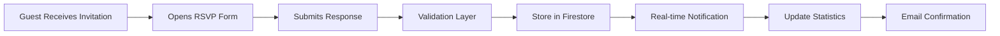

#### Guest Data Management
| Feature | Implementation | Business Rules |
|---------|----------------|----------------|
| Guest List Import | CSV parsing with validation | Max 1000 guests per invitation |
| Personal Links | URL generation with guest tokens | Unique tokens per guest |
| Response Tracking | Real-time status monitoring | Track open rates and responses |
| Reminder System | Automated follow-up scheduling | Configurable reminder intervals |

## Middleware & Interceptors

### Authentication Middleware

#### Route Protection Strategy


#### Permission Levels
| Role | Permissions | Route Access |
|------|-------------|-------------|
| Guest | View public invitations | /invitation/:slug |
| User | Create and manage own invitations | /editor, /dashboard |
| Premium | Advanced features and customization | /premium-features |
| Admin | Platform management | /admin/* |

### API Request Interceptors

#### Firebase Request Handling
| Interceptor Type | Purpose | Implementation |
|-----------------|---------|----------------|
| Authentication | Attach user tokens | Auto-refresh expired tokens |
| Error Handling | Centralized error processing | User-friendly error messages |
| Retry Logic | Handle network failures | Exponential backoff strategy |
| Rate Limiting | Prevent API abuse | Client-side throttling |

### Data Validation Middleware

#### Input Sanitization
- **XSS Prevention:** HTML content sanitization for user inputs
- **Data Type Validation:** Strong typing enforcement
- **Business Rule Validation:** Domain-specific constraints
- **File Upload Security:** MIME type verification and size limits

## Security Architecture

### Authentication & Authorization

#### Multi-Factor Authentication Flow


#### Session Management
| Aspect | Implementation | Security Measure |
|--------|----------------|------------------|
| Token Storage | Secure HTTP-only cookies | XSS protection |
| Session Timeout | 24-hour rolling expiration | Automatic renewal |
| Device Tracking | Browser fingerprinting | Suspicious login detection |
| Logout Handling | Server-side token invalidation | Complete session cleanup |

### Data Protection Measures

#### Encryption Strategy
- **Data in Transit:** TLS 1.3 for all communications
- **Data at Rest:** Firebase automatic encryption
- **Sensitive Data:** Client-side encryption for PII
- **API Keys:** Environment-based configuration

#### Privacy Controls
| Privacy Feature | Implementation | User Control |
|----------------|----------------|---------------|
| Invitation Visibility | Public/private toggle | Per-invitation setting |
| Guest Data Access | Granular sharing permissions | Owner-controlled |
| Search Engine Indexing | Meta robots configuration | Opt-out capability |
| Data Retention | Automated cleanup policies | User-initiated deletion |

## Performance Optimization

### Frontend Performance Strategy

#### Code Splitting Architecture


#### Asset Optimization Pipeline
| Asset Type | Optimization | Tools |
|------------|-------------|-------|
| Images | WebP conversion, compression | Sharp, ImageOptim |
| CSS | Purging, minification | PurgeCSS, PostCSS |
| JavaScript | Tree shaking, compression | Rollup, Terser |
| Fonts | Subsetting, preloading | Fonttools, Resource hints |

### Backend Performance Optimization

#### Firestore Query Optimization
- **Composite Indexes:** Optimized for common query patterns
- **Pagination Strategy:** Cursor-based pagination for large datasets
- **Caching Layer:** Redis for frequently accessed data
- **Connection Pooling:** Efficient database connection management

#### Firebase Functions Optimization
| Optimization | Strategy | Expected Benefit |
|-------------|----------|------------------|
| Cold Start Reduction | Keep functions warm | 50% faster initial response |
| Memory Management | Right-sized allocations | Cost optimization |
| Concurrent Processing | Batch operations | Improved throughput |
| Error Recovery | Circuit breaker pattern | System resilience |

## Monitoring & Analytics

### Application Performance Monitoring

#### Key Performance Indicators
| Metric | Target | Monitoring Tool |
|--------|--------|----------------|
| Page Load Time | < 2 seconds | Google Analytics |
| First Contentful Paint | < 1.5 seconds | Lighthouse CI |
| Cumulative Layout Shift | < 0.1 | Core Web Vitals |
| Time to Interactive | < 3 seconds | Performance API |

#### Error Tracking System


### Business Analytics

#### User Behavior Tracking
| Event Category | Events Tracked | Business Value |
|----------------|----------------|----------------|
| Invitation Creation | Template selection, completion rate | Feature popularity |
| User Engagement | Time spent, page views | User experience |
| RSVP Analytics | Response rates, guest behavior | Event success metrics |
| Conversion Funnel | Sign-up to publication | Optimization opportunities |

## Scalability Architecture

### Horizontal Scaling Strategy

#### Component Distribution


#### Database Scaling Approach
| Scaling Method | Implementation | Use Case |
|----------------|----------------|----------|
| Read Replicas | Multiple read-only instances | High read workloads |
| Sharding | Geographic distribution | Global user base |
| Caching | Redis cluster | Frequently accessed data |
| Connection Pooling | PgBouncer implementation | Connection efficiency |

### Capacity Planning

#### Resource Allocation Strategy
- **User Growth Projections:** Plan for 10x user growth within 12 months
- **Storage Requirements:** Dynamic scaling based on media uploads
- **Bandwidth Planning:** CDN optimization for global distribution
- **Processing Capacity:** Auto-scaling based on demand patterns

## Action Flow Architecture

### User Journey Workflows

#### Complete Invitation Creation Flow
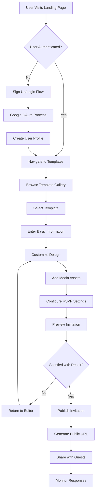

#### Guest Interaction Flow
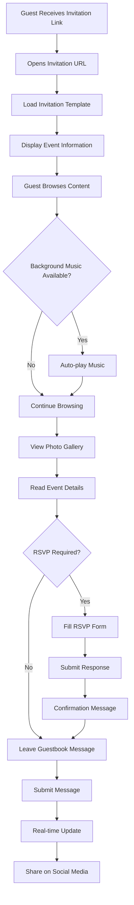

### System Process Flows

#### Template Rendering Process
```mermaid
flowchart LR
    A[Template Request] --> B[Load Template Schema]
    B --> C[Validate Template Data]
    C --> D[Apply User Customizations]
    D --> E[Merge Default Styles]
    E --> F[Process Media Assets]
    F --> G[Generate Component Tree]
    G --> H[Apply Animations]
    H --> I[Render Final Output]
    I --> J[Cache Rendered Template]
    J --> K[Serve to User]
```

#### Auto-Save Mechanism Flow
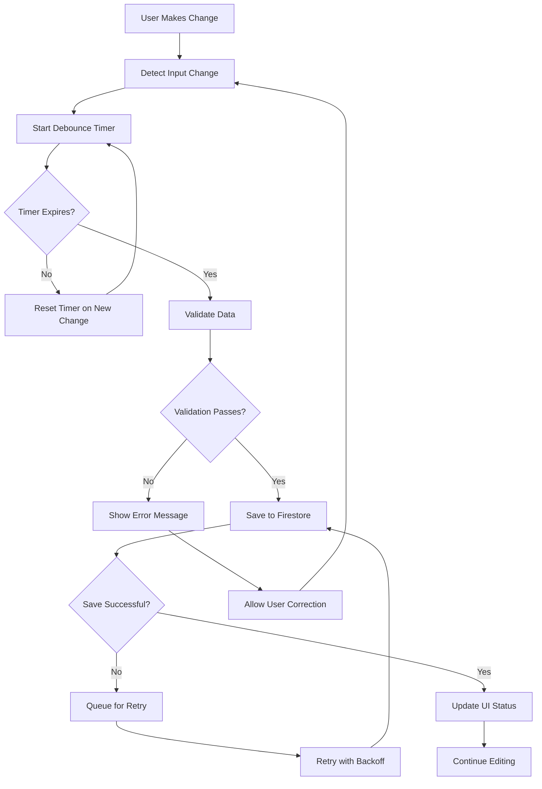

### Authentication & Authorization Flows

#### User Registration Process
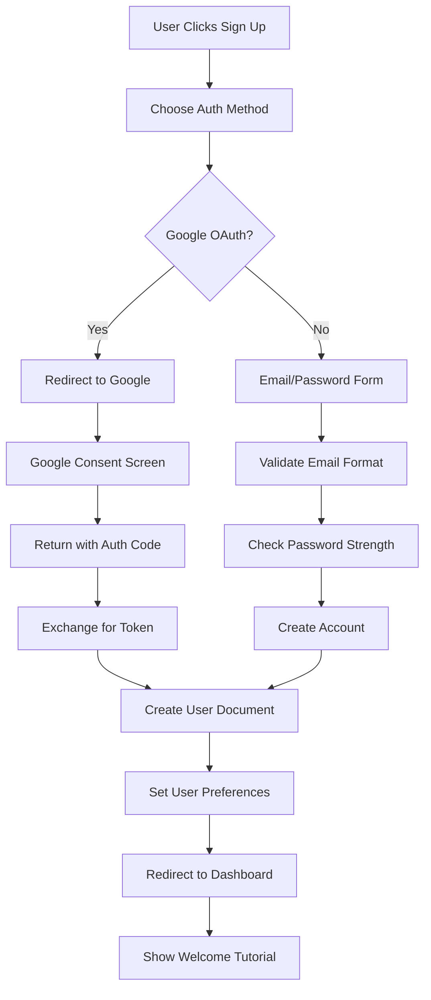

#### Permission Verification Flow
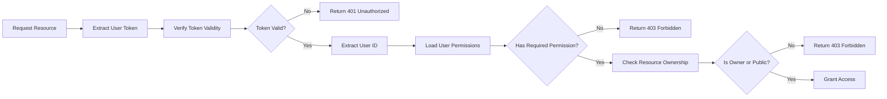

### Data Processing Workflows

#### RSVP Response Processing
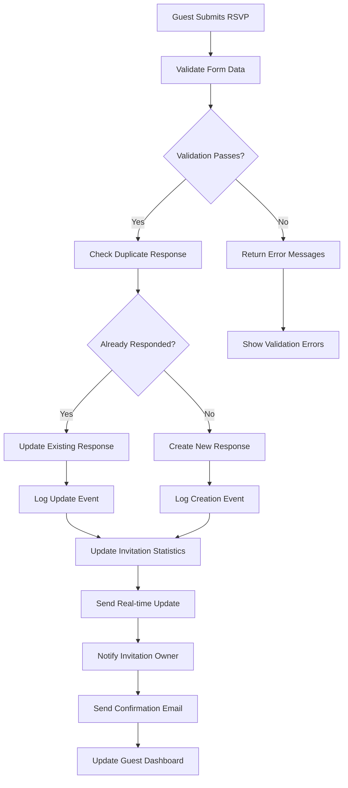

#### Media Upload Processing
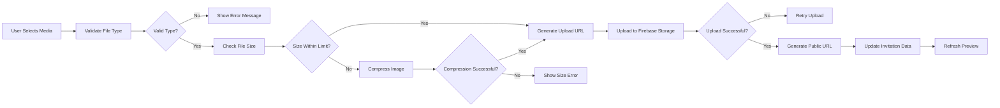

### Business Process Flows

#### Subscription Management Flow
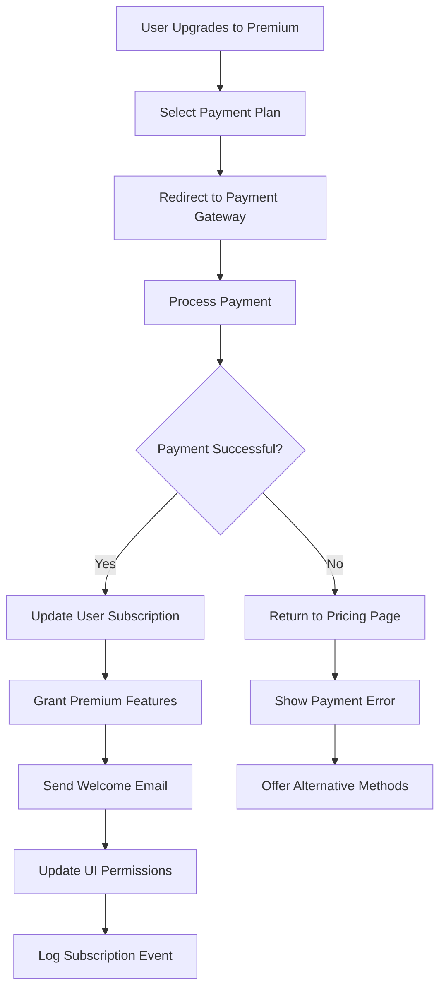

#### Template Marketplace Flow
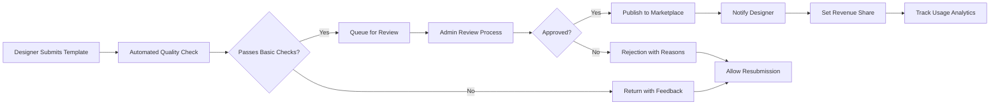

### Error Handling Workflows

#### Global Error Recovery Flow
```mermaid
flowchart TD
    A[Error Occurs] --> B[Error Boundary Catches]
    B --> C[Log Error Details]
    C --> D{Critical Error?}
    D -->|Yes| E[Show Fallback UI]
    D -->|No| F[Show Inline Error]
    E --> G[Offer Recovery Actions]
    F --> H[Allow User Retry]
    G --> I{User Chooses Recovery?}
    I -->|Refresh| J[Reload Application]
    I -->|Report| K[Submit Bug Report]
    I -->|Continue| L[Return to Safe State]
    H --> M{Retry Successful?}
    M -->|Yes| N[Continue Normal Flow]
    M -->|No| O[Escalate to Critical]
    O --> E
```

#### Network Failure Handling
```mermaid
flowchart LR
    A[Network Request Fails] --> B[Detect Connection Status]
    B --> C{Device Online?}
    C -->|No| D[Show Offline Message]
    C -->|Yes| E[Implement Retry Logic]
    D --> F[Queue Failed Requests]
    F --> G[Listen for Connection]
    G --> H{Connection Restored?}
    H -->|No| G
    H -->|Yes| I[Process Queued Requests]
    E --> J[Exponential Backoff]
    J --> K{Max Retries Reached?}
    K -->|No| L[Retry Request]
    K -->|Yes| M[Show Persistent Error]
    L --> N{Request Successful?}
    N -->|Yes| O[Continue Normal Flow]
    N -->|No| J
```

### Integration Workflows

#### Email Notification System
```mermaid
flowchart TD
    A[Trigger Event] --> B[Determine Email Type]
    B --> C[Load Email Template]
    C --> D[Personalize Content]
    D --> E[Validate Recipient]
    E --> F{Valid Email?}
    F -->|No| G[Log Invalid Email]
    F -->|Yes| H[Queue for Sending]
    H --> I[Send via Email Service]
    I --> J{Send Successful?}
    J -->|No| K[Retry with Delay]
    J -->|Yes| L[Log Success]
    K --> M{Max Retries?}
    M -->|No| I
    M -->|Yes| N[Mark as Failed]
    L --> O[Update Delivery Status]
    G --> P[Notify Admin]
    N --> P
```

#### Social Media Sharing Flow
```mermaid
flowchart LR
    A[User Clicks Share] --> B[Select Platform]
    B --> C[Generate Share URL]
    C --> D[Create Meta Tags]
    D --> E[Generate Preview Image]
    E --> F[Open Share Dialog]
    F --> G{User Confirms?}
    G -->|No| H[Cancel Share]
    G -->|Yes| I[Post to Platform]
    I --> J{Post Successful?}
    J -->|No| K[Show Error Message]
    J -->|Yes| L[Track Share Event]
    L --> M[Update Analytics]
    K --> N[Offer Alternative Methods]
```

These comprehensive action flows provide detailed guidance for implementing the user interactions, system processes, and business workflows throughout the Menantikan platform, ensuring consistent and reliable user experiences across all features and scenarios.