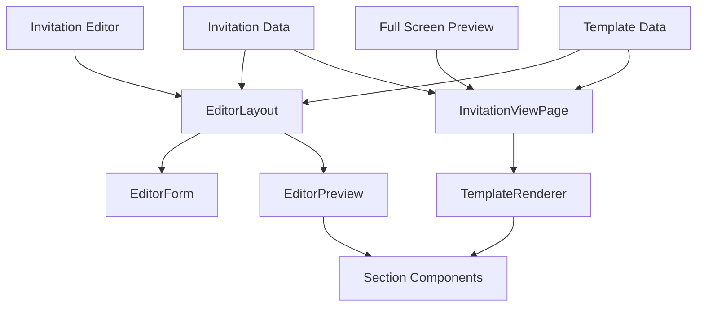
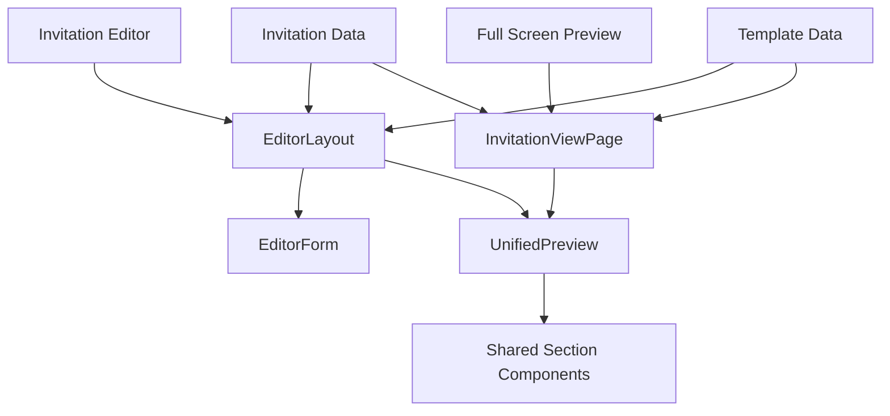
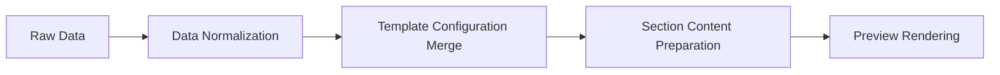

# Live Preview Adjustment Design Document

## Document Control

**Document Status:** Draft
**Last Updated:** 2024-05-21
**Author:** System Architect
**Reviewers:** Development Team

## Overview

This document outlines the design for aligning the live preview in the Invitation Editor with the full-screen preview to ensure consistency between what users see while editing and what recipients see when viewing the invitation.

The main goal is to ensure that the live preview in the editor matches the full-screen preview exactly, providing a consistent user experience throughout the invitation creation process.

### Problem Statement

Currently, there are discrepancies between the live preview in the Invitation Editor and the full-screen preview that recipients see. These inconsistencies include:

1. **Text Content Differences:** The hero section displays "Wedding Invitation" in the live preview but "The Wedding Of" in the full-screen preview
2. **Rendering Logic Differences:** The editor preview manually renders sections while the full-screen preview uses the TemplateRenderer component
3. **Styling Inconsistencies:** Different approaches to applying template configurations and custom themes
4. **Section Visibility Handling:** Different mechanisms for showing/hiding sections

### Template Preview Context

It's important to note that there are actually three preview contexts in the application:

1. **Editor Live Preview:** The mobile preview panel within the invitation editor
2. **Template Preview:** The preview shown when browsing templates in the gallery
3. **Full-Screen Preview:** The recipient view when viewing an invitation

All three previews should be consistent with each other to provide a seamless user experience.

## Architecture

The current architecture has two separate preview implementations:
1. **Editor Preview** - Located in `src/components/editor/EditorPreview.tsx`
2. **Full-Screen Preview** - Located in `src/pages/InvitationViewPage.tsx`

### Current Issues

1. **Separate Rendering Logic:** EditorPreview manually renders sections while InvitationViewPage uses TemplateRenderer
2. **Different Data Sources:** EditorPreview uses formData directly while InvitationViewPage uses sampleContent or actual invitation data
3. **Inconsistent Text Display:** Hero section shows different text in each preview
4. **Theming Differences:** Different approaches to applying template configurations
5. **Template Preview Discrepancies:** TemplatePreviewPage has its own rendering logic that may differ from both editor and full-screen previews

### Solution Approach

To achieve consistency across all three preview contexts, we will:
1. Refactor all preview components to use a shared rendering logic
2. Ensure all components use the same data flow and section rendering order
3. Align the styling and theming approaches between all components
4. Standardize the section components used in all previews
5. Create a unified data transformation pipeline
6. Ensure Template Preview uses the same rendering approach as the other previews

### Current Architecture Diagram



### Proposed Architecture Diagram



## Key Differences Analysis

### 1. Text Content Differences

**Editor Preview:**
- Displays couple names prominently
- Shows "Kami Mengundang" text
- Uses form data directly for text content

**Full-Screen Preview:**
- Displays "The Wedding Of" text
- Shows couple names in a different format
- Uses sample content or actual invitation data

### 2. Data Flow Differences

**Editor Preview:**
- Uses `formData` directly from the editor state
- Manually renders each section with hardcoded logic
- Does not fully utilize the template configuration system

**Full-Screen Preview:**
- Uses `sampleContent` or actual invitation data
- Uses `TemplateRenderer` for consistent rendering
- Properly applies template configurations and customizations

### 3. Styling and Theming

**Editor Preview:**
- Directly applies styles from `templateConfig`
- Does not fully implement dynamic theming

**Full-Screen Preview:**
- Uses CSS variables for dynamic theming
- Applies template configurations through `TemplateRenderer`

### 4. Section Visibility Handling

**Editor Preview:**
- Uses form data to determine section visibility
- Shows/hides sections based on form state

**Full-Screen Preview:**
- Uses template configuration to determine section visibility
- Respects sectionConfig.isVisible property

### 5. Template Preview Differences

**Template Preview (TemplatePreviewPage):**
- Uses sample content for all templates
- Has its own rendering implementation separate from both editor and full-screen previews
- Shows "Kami Mengundang" text in hero section
- Displays couple names prominently
- Does not use actual invitation data

**Comparison with Other Previews:**
- Template preview is more similar to editor preview in text display than full-screen preview
- Uses different animation implementations
- Has its own styling approach separate from TemplateRenderer

## Design Changes

### 1. Unified Preview Component

We will create a unified preview component that both the editor and full-screen preview can use:

#### Component Structure

```typescript
interface UnifiedPreviewProps {
  invitation: Invitation;
  content: Partial<InvitationContent>;
  templateConfig: TemplateConfig;
  className?: string;
  isEditorPreview?: boolean; // To handle editor-specific behavior
}
```

#### Implementation Details

The UnifiedPreview component will:
1. Use the same rendering logic as TemplateRenderer
2. Apply template configurations consistently
3. Handle section visibility based on template settings
4. Support both editor and full-screen contexts

### 2. Section Rendering Consistency

All three previews will use the same section components with the same props interface:

#### Standardized Section Component Interface

```typescript
interface SectionComponentProps {
  content: SectionContent;
  config: TemplateConfig;
  sectionConfig: SectionConfig;
  isPreview?: boolean;
}
```

#### Required Updates

1. **HeroSection Component:** Ensure consistent text display ("The Wedding Of")
2. **All Section Components:** Standardize prop interface
3. **Section Rendering Order:** Use template configuration order
4. **Visibility Handling:** Respect sectionConfig.isVisible property
5. **TemplatePreviewPage:** Update to use unified rendering approach

#### Template Preview Specific Updates

1. **Replace Manual Rendering:** Replace TemplatePreviewPage's manual section rendering with UnifiedPreview
2. **Use Sample Content Properly:** Ensure TemplatePreviewPage uses the same sample content generation as other previews
3. **Consistent Animations:** Align TemplatePreviewPage animations with other previews

### 3. Data Flow Alignment

We'll ensure both previews use the same data transformation logic:

#### Data Transformation Flow



## Implementation Plan

### Phase 1: Component Refactoring (Week 1)

1. **Create UnifiedPreview Component**
   - Extract shared rendering logic from all preview components
   - Implement consistent section rendering order
   - Standardize styling and theming application
   - Ensure proper handling of template configurations
   - Support all three preview contexts (editor, template, full-screen)

2. **Refactor Section Components**
   - Ensure all section components follow the standardized interface
   - Update components to properly handle preview vs. full-screen modes
   - Fix HeroSection to display "The Wedding Of" consistently
   - Standardize section visibility handling
   - Ensure consistent animation behavior across all contexts

### Phase 2: Data Flow Alignment (Week 2)

1. **Standardize Data Transformation**
   - Create utility functions for consistent data preparation
   - Ensure both previews use the same content merging logic
   - Implement proper handling of partial content data

2. **Template Configuration Handling**
   - Implement consistent template configuration merging
   - Ensure custom theme data is applied uniformly
   - Create utility for merging partial theme with default configurations

### Phase 3: Integration and Testing (Week 3)

1. **Integrate UnifiedPreview**
   - Replace EditorPreview with UnifiedPreview
   - Update InvitationViewPage to use UnifiedPreview where appropriate
   - Update TemplatePreviewPage to use UnifiedPreview
   - Ensure backward compatibility during transition
   - Update EditorLayout to pass correct data to UnifiedPreview

2. **Backward Compatibility Testing**
   - Verify existing invitations continue to render correctly
   - Test with legacy template configurations
   - Ensure no breaking changes for existing users

3. **Visual Consistency Testing**
   - Compare all three previews side-by-side
   - Verify all styling and layout consistency
   - Test with different template configurations
   - Validate responsive behavior consistency
   - Ensure text content matches across all contexts

## Section Component Updates

### Hero Section Consistency

All three previews must display "The Wedding Of" text instead of "Wedding Invitation" or "Kami Mengundang" to maintain consistency.

**Current Issues:**
- EditorPreview displays couple names and "Kami Mengundang"
- TemplatePreviewPage displays couple names and "Kami Mengundang"
- Full-Screen Preview shows "The Wedding Of"

**Solution:** 
1. Update EditorPreview to use the same text as full-screen preview
2. Update TemplatePreviewPage to use the same text as full-screen preview
3. Ensure HeroSection component displays consistent text in all contexts
4. Update the couple names display logic to match between previews

**Technical Implementation:**
- Modify EditorPreview to display "The Wedding Of" instead of couple names in the hero section
- Modify TemplatePreviewPage to display "The Wedding Of" instead of "Kami Mengundang"
- Ensure couple names are displayed in the same format as the full-screen preview
- Update the text hierarchy to match the full-screen preview exactly

### Section Visibility Management

Both previews must respect the section visibility settings from the template configuration rather than using form data directly.

**Current Issue:** EditorPreview uses formData to determine section visibility while full-screen preview uses template configuration

**Solution:**
1. Update EditorPreview to use template configuration for section visibility
2. Ensure section toggle switches in editor properly update template configuration
3. Maintain backward compatibility with existing form data approach

### Content Data Handling

Both previews must use consistent data transformation logic.

**Current Issue:** EditorPreview uses raw formData while full-screen preview uses processed sampleContent

**Solution:**
1. Create unified data transformation utility
2. Ensure both previews process data through the same pipeline
3. Handle partial content data consistently

## Testing Strategy

### Visual Consistency Tests

1. **Side-by-side Comparison**
   - Render all three previews with identical data
   - Verify visual elements match exactly
   - Check responsive behavior consistency

2. **Template Variation Testing**
   - Test with all sample templates
   - Verify consistency across different color schemes
   - Check typography consistency

3. **Specific Component Testing**
   - Verify Hero section text consistency
   - Check section visibility toggling
   - Validate animation behavior consistency

4. **Cross-Context Testing**
   - Verify consistency between editor, template, and full-screen previews
   - Test text content matching across all contexts
   - Validate that "The Wedding Of" text is displayed consistently
### Data Flow Tests

1. **Content Synchronization**
   - Verify form data changes reflect immediately in both previews
   - Test with partial content data
   - Validate default content handling

2. **Theme Application**
   - Test custom theme application
   - Verify color scheme consistency
   - Check typography consistency

3. **Edge Case Testing**
   - Test with missing section data
   - Validate behavior with incomplete form data
   - Check error handling consistency

### Performance Tests

1. **Rendering Performance**
   - Measure preview rendering times
   - Verify no performance degradation
   - Test with large template configurations

2. **Memory Usage**
   - Monitor memory consumption
   - Ensure efficient component re-rendering

## Benefits

1. **Consistent User Experience**
   - Users see exactly what recipients will see
   - Eliminates confusion about final output
   - Builds trust in the editing process
   - Consistent experience across template browsing, editing, and viewing

2. **Reduced Maintenance**
   - Single implementation for preview logic
   - Easier to update and maintain
   - Reduced code duplication
   - Single point of truth for preview rendering

3. **Improved Reliability**
   - Consistent rendering across all contexts
   - Reduced chance of discrepancies
   - Easier debugging and issue resolution
   - Uniform behavior across all preview contexts

## Success Criteria

1. **Visual Consistency**
   - All three previews display identical content with the same styling
   - All text elements match exactly between previews
   - Section visibility behavior is consistent
   - Hero section displays "The Wedding Of" text in all contexts

2. **Functional Consistency**
   - Form data changes reflect immediately in all previews
   - Template customizations apply uniformly
   - All interactive elements behave consistently

3. **Performance Standards**
   - Preview rendering time under 200ms
   - No memory leaks or performance degradation
   - Smooth real-time updates during editing

## Risks and Mitigations

### Risk 1: Performance Impact
**Mitigation:** Optimize the unified component to ensure efficient rendering

### Risk 2: Breaking Changes
**Mitigation:** Maintain backward compatibility during the transition

### Risk 3: Visual Discrepancies
**Mitigation:** Thorough testing with various templates and content combinations

### Risk 4: User Confusion
**Mitigation:** Communicate changes clearly and provide transition guidance

### Risk 5: Template Preview Regression
**Mitigation:** Maintain thorough test coverage for TemplatePreviewPage during refactoring

### Risk 6: Animation Inconsistencies
**Mitigation:** Standardize animation implementations across all preview contexts

## Deployment Considerations

### Rollback Procedures

1. **Component-level Rollback**
   - Maintain backup of original EditorPreview component
   - Maintain backup of original TemplatePreviewPage component
   - Ability to revert to separate preview implementations

2. **Data Flow Rollback**
   - Preserve original data transformation logic
   - Maintain compatibility with existing form data structures

3. **Template Preview Rollback**
   - Preserve original TemplatePreviewPage implementation
   - Maintain ability to revert to manual rendering approach

### Monitoring Requirements

1. **Performance Monitoring**
   - Track preview rendering times
   - Monitor memory usage during editing sessions

2. **Error Tracking**
   - Log any preview rendering errors
   - Monitor user-reported inconsistencies

### User Communication

1. **Release Notes**
   - Document changes in release notes
   - Highlight benefits of improved consistency

2. **User Support**
   - Prepare support documentation
   - Train support team on new behavior

### Template Gallery Impact

1. **Template Preview Consistency**
   - Ensure template previews in the gallery match the actual invitation views
   - Maintain consistent user experience when browsing templates

2. **User Expectation Management**
   - Ensure users know what they'll get when they select a template
   - Reduce discrepancy between preview and actual implementation