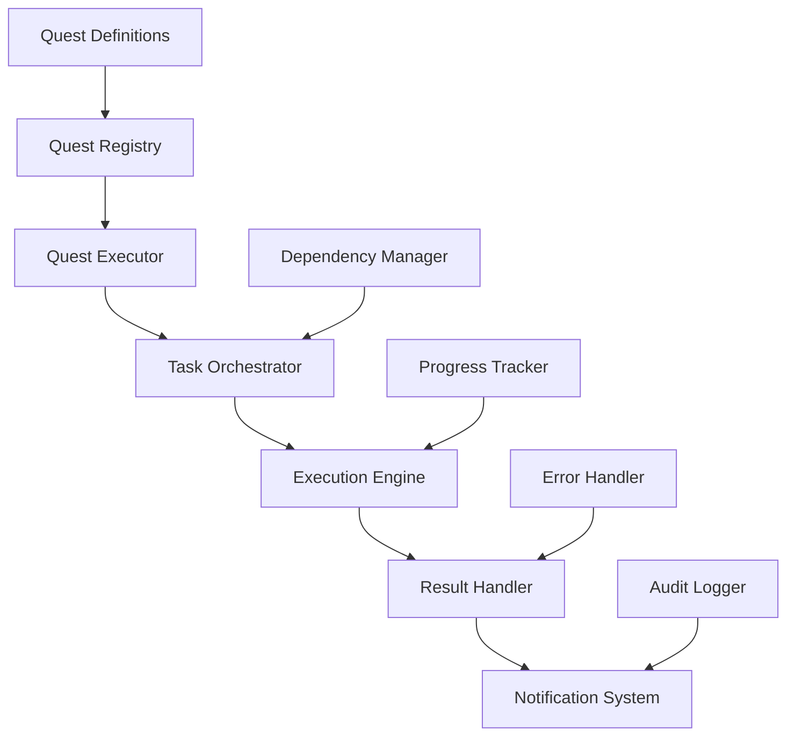

# Quest Execution System - Design Document

## Overview

The Quest Execution System is a workflow management component that automates and orchestrates various development tasks and processes within the Menantikan digital invitation platform. This system enables the execution of predefined quests that can range from project setup tasks to feature implementation workflows.

**Primary Purpose:** Automate repetitive development tasks and ensure consistent execution of complex workflows  
**Target Users:** Developers, project managers, and automated CI/CD systems  
**Integration Point:** Embedded within the Menantikan platform development workflow

## Architecture

### Quest System Components



### Core System Architecture

| Component | Responsibility | Key Functions |
|-----------|---------------|---------------|
| Quest Registry | Quest discovery and validation | Quest listing, metadata management, version control |
| Quest Executor | Execution coordination | Quest initialization, parameter validation, execution lifecycle |
| Task Orchestrator | Task sequencing and dependency management | Task ordering, parallel execution, dependency resolution |
| Execution Engine | Actual task execution | Command execution, environment management, resource allocation |
| Result Handler | Output processing and validation | Result validation, success/failure determination, cleanup |

### Quest Definition Structure

#### Quest Metadata Schema
| Field | Type | Purpose | Validation Rules |
|-------|------|---------|-----------------|
| id | string | Unique quest identifier | Alphanumeric, no spaces |
| name | string | Human-readable quest name | 1-100 characters |
| description | string | Quest purpose and overview | Detailed description |
| version | string | Quest version number | Semantic versioning |
| dependencies | array | Required quest prerequisites | Valid quest IDs |
| parameters | object | Configurable quest inputs | Type-validated parameters |
| tasks | array | Ordered list of execution tasks | Task definition objects |

#### Task Definition Schema
| Field | Type | Purpose | Examples |
|-------|------|---------|----------|
| taskId | string | Task identifier | setup-environment, build-components |
| type | string | Task execution type | command, function, validation |
| command | string | Executable command | npm install, git clone |
| parameters | object | Task-specific inputs | File paths, configuration values |
| retryPolicy | object | Failure handling rules | Max retries, backoff strategy |
| timeout | number | Maximum execution time | Seconds |

## Quest Execution Workflow

### Quest Discovery Process

```mermaid
flowchart TD
    A[Quest Execution Request] --> B[Scan Quest Directory]
    B --> C[Load Quest Definitions]
    C --> D[Validate Quest Schema]


